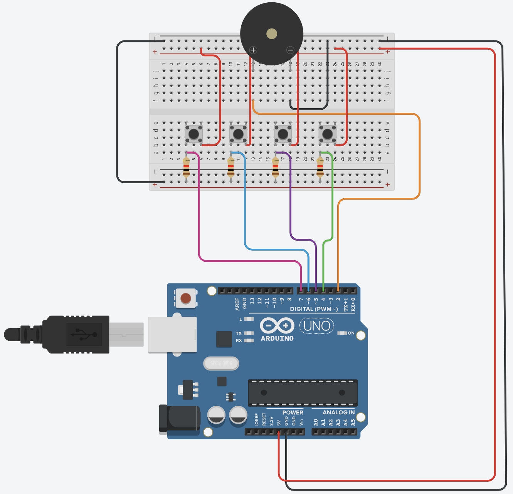

# arduino-piano

A project that plays different musical tones when buttons are pressed, available in two implementations:

1. **Arduino Version**: Uses Arduino libraries for simplicity.
2. **Embedded C Version**: Built without Arduino libraries for greater control and efficiency.

---

## Table of Contents

- [Overview](#overview)
- [Project Tree](#project-tree)
- [Project Versions](#project-versions)
  - [1. Arduino Version](#1-arduino-version)
  - [2. Embedded C Version](#2-embedded-c-version)
- [Compilation & Uploading](#compilation--uploading)
- [License](#license)

---

## Overview

This project allows users to generate specific musical tones by pressing buttons connected to an Arduino Uno (ATmega328P). Each button corresponds to a unique frequency, and actions are communicated via serial output.

- **Arduino Version**: Ideal for beginners with straightforward setup using built-in libraries.
- **Embedded C Version**: Suitable for advanced users seeking optimized performance and deeper hardware interaction.

---

## Project Tree

```
.
├── LICENSE
├── Makefile
├── README.md
├── arduino-piano
│   └── arduino-piano.ino
├── include
│   └── definitions.h
├── lib
│   ├── delay
│   │   ├── delay.c
│   │   └── delay.h
│   ├── io
│   │   ├── io.c
│   │   └── io.h
│   ├── serial
│   │   ├── serial.c
│   │   └── serial.h
│   ├── timer
│   │   ├── timer.c
│   │   └── timer.h
│   └── tone
│       ├── tone.c
│       └── tone.h
└── src
    ├── constants.c
    └── main.c
```



---

## Project Versions

### 1. Arduino Version

- **File**: `arduino-piano/arduino-piano.ino`
- **Features**:
  - Plays a specific tone when a button is pressed.
  - Uses Arduino libraries for ease of use.
  - Ideal for users new to microcontroller programming.

### 2. Embedded C Version

- **Files**: Located in `src/`, `lib/`, and `include/`
- **Features**:
  - Written in embedded C for finer control over the hardware.
  - Uses AVR-specific libraries for serial communication, tone generation, and button handling.


---

## Compilation & Uploading

### Arduino Version

1. **Using Arduino IDE**:
   - Open `arduino-piano.ino` in the Arduino IDE.
   - Select the correct board and port.
   - Click **Upload**.

### Embedded C Version

1. **Requirements**:
   - Install `avr-gcc` and `avrdude`.

2. **Compile and Upload**:
   - Navigate to the project directory.
   - Run the following commands:
     ```sh
     make
     make upload
     ```
   - Clean up generated files (optional):
     ```sh
     make clean
     ```

---

## License

This project is licensed under the [MIT License](LICENSE).
